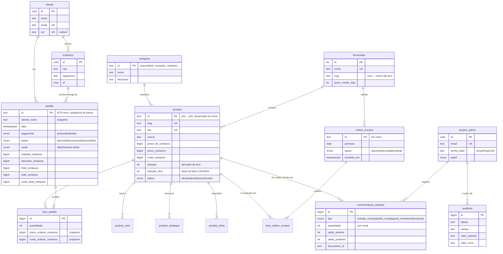

# Arquitetura do banco — BIG TECH STORE

Diagrama, decisões e divergências. Leia antes de mexer no esquema.

Implementa `web/PROMPT-BANCO-DE-DADOS.md`. O front-end (`web/`) **não foi
alterado** nesta etapa: o banco nasce primeiro, é revisado contra o front, e só
então a API entra.

---

## Diagrama ER



---

## As 8 correções do prompt, e onde cada uma foi resolvida

| # | Correção | Onde |
|---|---|---|
| 1 | Dinheiro nunca em float | `BIGINT` em centavos, sufixo `_centavos`, em toda coluna monetária |
| 2 | Fornecedor vira tabela | `fornecedor` (migration 002), FK em `produto` e `ordem_compra` |
| 3 | Categoria vira tabela | `categoria` com o slug como PK (002) |
| 4 | Cliente vira tabela | `cliente` + `endereco` (003), com os campos que o checkout já coleta |
| 5 | Estoque precisa de razão | `movimentacao_estoque` + `fn_registrar_movimentacao` (006) |
| 6 | Preço não vem do cliente | `parametro` + `fn_calcular_desconto` + `fn_finalizar_pedido` (008) |
| 7 | Snapshot no item é regra | `item_pedido.preco_unitario_centavos` / `custo_unitario_centavos` (004) |
| 8 | Produto não se apaga | `produto.status` + FK `ON DELETE RESTRICT` (002, 004) |

A correção 5 é a que mais muda o dia a dia: `produto.estoque` deixou de ser um
número editável e virou consequência de um livro. Existe uma view de
conciliação (`vw_conciliacao_estoque`) que deve vir **sempre vazia** — se vier
linha, alguém escreveu no saldo por fora.

---

## Fluxo de estoque

```
ordem_compra RECEBIDA ──fn_receber_ordem_compra──► entrada_compra ──┐
                                                                    ├─► produto.estoque
pedido APROVADO ──────fn_finalizar_pedido───────► saida_venda ─────┤
                                                                    │
acerto de inventário ─fn_ajustar_estoque────────► ajuste_inventario ┘
                              │
                              └──alimenta──► vendas · financeiro · analytics
```

Ordem em rascunho ou enviada **não** move nada. Só o recebimento move.

---

## Concorrência

`fn_finalizar_pedido` trava as linhas de produto com `SELECT … FOR UPDATE`
**sempre em ordem de id**. Dois carrinhos com os mesmos itens em ordens
diferentes viram fila em vez de deadlock.

Há três camadas de proteção contra vender a última unidade duas vezes:

1. a trava de linha, que serializa quem disputa o mesmo SKU;
2. a checagem dentro de `fn_registrar_movimentacao`, com mensagem legível;
3. o `CHECK (estoque >= 0)` na tabela — que vale mesmo se alguém escrever SQL
   por fora das funções.

Verificado com duas conexões simultâneas (`testes/concorrencia.ps1`): a segunda
sessão ficou 6,6 s bloqueada, destravou quando a primeira confirmou, releu o
saldo já zerado e foi recusada. Uma venda, uma recusa, estoque final zero.

---

## Papéis e acesso

Decisão do cliente: papéis são **tabelas da aplicação**, não roles nativas com
RLS. Quem aplica a regra é a API. O caminho para RLS fica aberto — `papel` já
está normalizado em enum.

| Papel | Acesso pretendido |
|---|---|
| `admin` | tudo |
| `estoque` | `produto`, `movimentacao_estoque`, `fn_ajustar_estoque` |
| `compras` | `ordem_compra`, `fornecedor`, `fn_receber_ordem_compra`, leitura de estoque |
| `vendas` | `pedido`, `fn_cobertura`, leitura de estoque |
| `financeiro` | funções de receita/custo/margem, `vw_contas_a_pagar` |

Auditoria: trigger em `produto` (preço, custo, estoque, estoque-alvo, status) e
em `ordem_compra.status`. O autor vem de
`set_config('bts.usuario_id', '<uuid>', true)`, que a API declara no início da
transação — o `true` limita ao escopo da transação e não vaza para a próxima
requisição do mesmo pool.

---

## Divergências e decisões

Onde eu me afastei do prompt, e por quê.

### 1. PostgreSQL 17, não 16
É o que o Neon provisiona. Nada no esquema depende de recurso da 17.

### 2. Duas receitas no painel — inconsistência do front, reproduzida de propósito
O achado mais relevante desta etapa. O front calcula receita de **duas formas
diferentes** e mostra as duas no mesmo painel:

- **líquida** (`pedido.total`, já com o desconto do Pix) — usada no resumo, na
  série diária, na mensal e nas formas de pagamento;
- **bruta dos itens** (Σ preço × quantidade, **sem** o desconto) — usada no
  ranking e na receita por categoria.

Em 90 dias do seed a diferença é **R$ 35.987,95** (R$ 1.645.410,05 líquida
contra R$ 1.681.398,00 bruta) — exatamente o desconto do Pix acumulado. As
funções SQL reproduzem as duas, porque a meta desta etapa era paridade. **É
decisão de negócio, não de banco**, e vale resolver antes da API: ou o ranking
passa a ratear o desconto por item, ou o painel rotula explicitamente "receita
bruta".

### 3. Fuso: dia civil de São Paulo, não UTC
O prompt exige e o mock faz o contrário (`p.data.slice(0,10)` = dia UTC).
Verificado que **não quebra a paridade neste seed**: o gerador cria pedidos
entre 8h e 21h UTC, que em BRT caem entre 5h e 18h do mesmo dia civil — nenhum
pedido cruza a virada. A série diária bateu ponto a ponto nas três janelas. A
diferença só apareceria com pedidos de madrugada, que é justamente quando o
mock erraria.

### 4. Id do pedido passa a ser do banco
O front usa `BTS-${Date.now()/1000 % 100000}`, que colide entre dois pedidos no
mesmo segundo e repete o ciclo a cada ~27 horas. Agora é `'BTS-' || nextval`.

### 5. Desempate no ranking
O front ordena só por unidades e se apoia na estabilidade do `sort` do
JavaScript. SQL não tem essa garantia, então o desempate é explícito:
unidades → receita → id. O teste de paridade aplica o mesmo critério dos dois
lados.

### 6. `frete_centavos` é extensão
O tipo `Pedido` do mock não guarda frete — o carrinho apenas o exibe. A coluna
existe, nasce zerada no seed, e a regra está parametrizada.
**Atenção na integração:** `fn_finalizar_pedido` SOMA frete ao total; o checkout
do front hoje não soma. Alinhar antes de ligar o checkout real.

### 7. `nota` e `avaliacoes` seguem desnormalizados
Enquanto não existir tabela de avaliação escrita (fora de escopo), são colunas
de `produto`. Quando existir, viram derivadas.

### 8. `endereco` não tem bairro
Porque o checkout não pergunta. Campo que nenhuma tela preenche nasce nulo para
sempre. Entra junto com o ViaCEP.

### 9. `cliente.cpf` nulável e sem CPF no seed
O histórico do mock só tem o nome do comprador. Seed não inventa documento de
pessoa. E-mail usa `example.com` (RFC 2606), que não existe e não entrega
mensagem.

### 10. Recebimento aceita ordem em rascunho
O painel atual mostra "Receber no estoque" para todo status ≠ `recebida`,
inclusive rascunho. A função foi mantida fiel a isso. Exigir passagem por
"enviada" é endurecimento razoável — a combinar junto com a API.

### 11. `fornecedor.prazo_medio_dias` uniforme em 15
Placeholder. O mock não tem esse dado. As ordens do seed sugerem prazos de 8 a
12 dias, mas duas amostras por fornecedor não são média — seria precisão falsa.
Vem do cadastro real de fornecedores (`TODO.md`).

### 12. Migration 011 nasceu da revisão, não do plano
A revisão tela a tela (`REVISAO-FRONT.md`) encontrou três coisas que a vitrine
já faz e o esquema não servia: desconto percentual, busca sobre `resumo` e
categoria, e giro por produto incluindo os que venderam zero. Viraram a
migration `011_vitrine.sql`. Achar isso agora custou uma migration; achar depois
custaria metade da API reescrita.

### 13. Migrations aplicadas direto na branch principal
O plano previa aplicá-las primeiro numa branch temporária. Como o projeto Neon
foi criado vazio para este fim, não havia dado a proteger, e cada migration
exigiria um ciclo de confirmação. A branch descartável foi usada onde ela
realmente importa: nos testes que **alteram dados** (fluxo e concorrência).

---

## O que ainda não existe

Fora de escopo por decisão do prompt, porque nenhuma tela consome: cupom de
desconto, lista de desejos, avaliação escrita com moderação, preço de atacado,
gateway de pagamento e transportadora. Estão em `web/TODO.md`.

Também não há: agregação materializada (medida como desnecessária — ver
`README.md`), particionamento de `pedido` e RLS.
